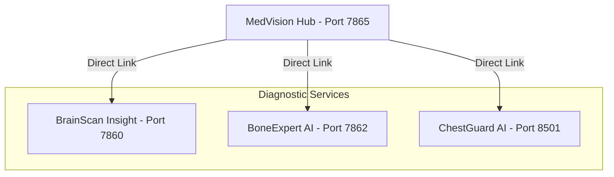

# MedVision AI: Unified Medical Diagnostic Platform

MedVision AI is an advanced, multi-modal medical imaging diagnostic platform. It integrates multiple specialized deep learning engines to assist healthcare professionals in analyzing MRI and X-ray images, providing explainable visual attention maps (Grad-CAM), and generating automated, downloadable PDF clinical reports.

---

## System Architecture

The platform is organized as a microservices-inspired architecture. A central dashboard hub manages routing and user navigation to three distinct, specialized diagnostic engines.



---

## Core Platform Components

### 1. MedVision Hub
*   **Location**: [MedVision_Hub/](file:///c:/Users/vijayendravarma/Desktop/medical_project/MedVision_Hub)
*   **Technology**: Gradio Web Application
*   **Default Port**: 7865
*   **Description**: Serves as the gateway for the entire suite. It presents a clean interface that allows users to quickly launch the appropriate tool for their diagnostic needs.

### 2. BrainScan Insight (Brain MRI Tumor Detection)
*   **Location**: [MedVision_Brain/](file:///c:/Users/vijayendravarma/Desktop/medical_project/MedVision_Brain)
*   **Technology**: PyTorch, EfficientNet-B0, Gradio (Port 7860)
*   **Diagnostic Capabilities**: Classifies brain MRI scans into four distinct categories:
    *   Glioma
    *   Meningioma
    *   Pituitary Tumor
    *   Normal / Healthy Brain
*   **Key Features**:
    *   Class-level probability breakdown.
    *   Visual attention localization using Grad-CAM.
    *   Automatic generation of Clinical Reports exported to PDF.

### 3. BoneExpert AI (Bone Fracture Detection)
*   **Location**: [BoneGuard_AI/](file:///c:/Users/vijayendravarma/Desktop/medical_project/BoneGuard_AI)
*   **Technology**: PyTorch, timm (EfficientNet-B3), Gradio (Port 7862)
*   **Diagnostic Capabilities**: Identifies presence or absence of skeletal fractures.
    *   Fracture Detected
    *   Normal Bone
*   **Key Features**:
    *   Custom lightweight Grad-CAM engine using native PyTorch backward hooks.
    *   Automated orthopedic recommendation report generation.
    *   Downloadable PDF reports.

### 4. ChestGuard AI (Chest Disease Detection)
*   **Location**: [Chest_Model/](file:///c:/Users/vijayendravarma/Desktop/medical_project/Chest_Model)
*   **Technology**: PyTorch, DenseNet-121, Streamlit (Port 8501)
*   **Diagnostic Capabilities**: Identifies pulmonary diseases from Chest X-Rays:
    *   Pneumonia
    *   Normal
*   **Key Features**:
    *   Side-by-side comparison between the original X-ray and the Grad-CAM heatmap.
    *   Double download buttons for downloading the visual Grad-CAM heatmap and the clinical PDF report.

---

## Technology Stack

| Component | Framework / Library | Purpose |
| :--- | :--- | :--- |
| Core Deep Learning | PyTorch, torchvision, timm | Model design, training, and inference |
| Web UI | Streamlit, Gradio | Interactive dashboards and user interfaces |
| Explainable AI | pytorch_grad_cam, Custom Hooks | Localization of diagnostic regions of interest |
| PDF Generation | ReportLab | Compilation of text findings into clinical reports |
| Image Processing | OpenCV, Pillow (PIL), NumPy | Image resizing, color space conversions, overlays |

---

## Setup and Installation

Each diagnostic application operates as a standalone service with its own configuration.

### Prerequisites
*   Python 3.8 or higher
*   pip (Python Package Installer)

### Installation Steps

1.  **Clone the Repository**
    ```bash
    git clone <repository-url>
    cd medical_project
    ```

2.  **Set Up Individual Virtual Environments**
    It is recommended to run each service in its own isolated environment to prevent dependency conflicts.
    
    *   **Brain MRI System**:
        ```bash
        cd MedVision_Brain
        python -m venv venv
        venv\Scripts\activate
        pip install -r requirements.txt
        deactivate
        cd ..
        ```
        
    *   **Bone Fracture System**:
        ```bash
        cd BoneGuard_AI
        python -m venv venv
        venv\Scripts\activate
        pip install -r requirements.txt
        deactivate
        cd ..
        ```
        
    *   **Chest Disease System**:
        ```bash
        cd Chest_Model
        python -m venv venv
        venv\Scripts\activate
        pip install -r requirements.txt
        deactivate
        cd ..
        ```

---

## Running the Platform

To run the complete suite, launch the services in separate terminal sessions:

1.  **Start Brain MRI System** (Port 7860):
    ```bash
    cd MedVision_Brain
    venv\Scripts\activate
    python app.py
    ```

2.  **Start Bone Fracture System** (Port 7862):
    ```bash
    cd BoneGuard_AI
    venv\Scripts\activate
    python app.py
    ```

3.  **Start Chest Disease System** (Port 8501):
    ```bash
    cd Chest_Model
    venv\Scripts\activate
    streamlit run app.py
    ```

4.  **Start the Central Hub** (Port 7865):
    ```bash
    cd MedVision_Hub
    # Use any of the virtual environments or global python env containing gradio
    python app.py
    ```

Open your browser and navigate to `http://localhost:7865` to access the main portal.
